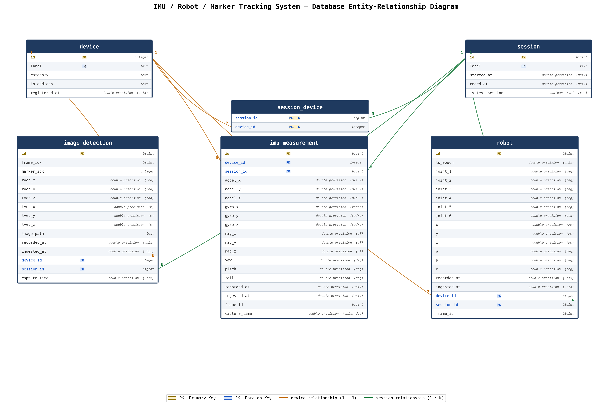

# Database Structure Documentation

**System:** Database for IMU / Robot / Marker-Tracking (Camera)

**Database engine:** PostgreSQL

**Schema:** `public`

**Tables:** `device`, `session`, `session_device`, `image_detection`, `imu_measurement`, `robot`

---

## 1. Overview

The database captures synchronized multi-modal sensor data (IMU readings, marker/AprilTag-style image detections, and robot arm pose) collected across recording **sessions** from a set of registered **devices**.

- `device` — registry of every physical sensor/device in the system.
- `session` — a discrete data-collection run.
- `session_device` — join table linking which devices participated in which sessions (many-to-many).
- `imu_measurement`, `image_detection`, `robot` — the three time-series measurement tables, each tied to exactly one `device` and one `session`.

### Entity-Relationship Diagram

*Orange lines: `device` → measurement/junction table relationships (1:N). Green lines: `session` → measurement/junction table relationships (1:N). `session_device` implements the many-to-many relationship between `device` and `session`.*

---

## 2. Table Reference

### 2.1 `device`

Registry of physical devices (sensors, cameras, robot controllers) in the system.

| Column | Type | Nullable | Default | Key | Notes |
|---|---|---|---|---|---|
| `id` | `integer` | NO | — | **PK** | Unique device identifier |
| `label` | `text`¹ | NO | — | UQ | Human-readable, unique device name |
| `category` | `text`¹ | NO | — | | Device type/class (e.g. IMU, camera, robot) |
| `ip_address` | `text`¹ | NO | — | | Network address of the device |
| `registered_at` | `double precision` | NO | — | | Unix timestamp of device registration |

### 2.2 `session`

A discrete data-collection run.

| Column | Type | Nullable | Default | Key | Notes |
|---|---|---|---|---|---|
| `id` | `bigint` | NO | — | **PK** | Unique session identifier |
| `label` | `text`¹ | NO | — | UQ | Human-readable, unique session name |
| `started_at` | `double precision` | NO | — | | Unix timestamp session began |
| `ended_at` | `double precision` | YES | — | | Unix timestamp session ended (null while in progress) |
| `is_test_session` | `boolean`¹ | NO | `true` | | Flags whether this is a test run vs. a real data-collection run |

### 2.3 `session_device`

Join table associating devices with the sessions they participated in (many-to-many).

| Column | Type | Nullable | Default | Key | Notes |
|---|---|---|---|---|---|
| `session_id` | `bigint` | NO | — | **PK, FK** → `session.id` | |
| `device_id` | `integer` | NO | — | **PK, FK** → `device.id` | |

Composite primary key on (`session_id`, `device_id`).

### 2.4 `image_detection`

Per-frame marker/AprilTag pose detections from camera devices (OpenCV-style rotation/translation vectors).

| Column | Type | Nullable | Default | Key | Notes |
|---|---|---|---|---|---|
| `id` | `bigint` | NO | — | **PK** | |
| `frame_idx` | `bigint` | NO | — | | Frame index within the capture stream |
| `marker_idx` | `integer` | NO | — | | Identifier of the detected marker |
| `rvec_x` | `double precision` | NO | — | | Rotation vector X (**rad**) |
| `rvec_y` | `double precision` | NO | — | | Rotation vector Y (**rad**) |
| `rvec_z` | `double precision` | NO | — | | Rotation vector Z (**rad**) |
| `tvec_x` | `double precision` | NO | — | | Translation vector X (**m**) |
| `tvec_y` | `double precision` | NO | — | | Translation vector Y (**m**) |
| `tvec_z` | `double precision` | NO | — | | Translation vector Z (**m**) |
| `image_path` | `text`¹ | NO | — | | Path to the associated captured image |
| `recorded_at` | `double precision` | NO | — | | Unix timestamp the detection was recorded |
| `ingested_at` | `double precision` | NO | — | | Unix timestamp the row was ingested into the DB |
| `device_id` | `integer` | NO | — | FK → `device.id` | |
| `session_id` | `bigint` | NO | — | FK → `session.id` | |
| `capture_time` | `double precision` | YES | — | | Unix timestamp of image capture |

### 2.5 `imu_measurement`

Raw and fused IMU readings.

| Column | Type | Nullable | Default | Key | Notes |
|---|---|---|---|---|---|
| `id` | `bigint` | NO | — | **PK** | |
| `device_id` | `integer` | NO | — | FK → `device.id` | |
| `session_id` | `bigint` | NO | — | FK → `session.id` | |
| `accel_x` | `double precision` | NO | — | | Acceleration X (**m/s²**) |
| `accel_y` | `double precision` | NO | — | | Acceleration Y (**m/s²**) |
| `accel_z` | `double precision` | NO | — | | Acceleration Z (**m/s²**) |
| `gyro_x` | `double precision` | NO | — | | Angular velocity X (**rad/s**) |
| `gyro_y` | `double precision` | NO | — | | Angular velocity Y (**rad/s**) |
| `gyro_z` | `double precision` | NO | — | | Angular velocity Z (**rad/s**) |
| `mag_x` | `double precision` | NO | — | | Magnetic field X (**µT**) |
| `mag_y` | `double precision` | NO | — | | Magnetic field Y (**µT**) |
| `mag_z` | `double precision` | NO | — | | Magnetic field Z (**µT**) |
| `yaw` | `double precision` | NO | — | | Orientation yaw (**degrees**) |
| `pitch` | `double precision` | NO | — | | Orientation pitch (**degrees**) |
| `roll` | `double precision` | NO | — | | Orientation roll (**degrees**) |
| `recorded_at` | `double precision` | NO | — | | Unix timestamp the sample was recorded |
| `ingested_at` | `double precision` | NO | — | | Unix timestamp the row was ingested into the DB |
| `frame_id` | `bigint` | YES | — | | Associated video/capture frame identifier |
| `capture_time` | `double precision` | YES | — | | Unix timestamp from the device's own clock |

### 2.6 `robot`

Robot arm joint positions and tool-center-point (TCP) pose.

| Column | Type | Nullable | Default | Key | Notes |
|---|---|---|---|---|---|
| `id` | `bigint` | NO | — | **PK** | |
| `ts_epoch` | `double precision` | NO | — | | Robot controller clock timestamp (Unix) |
| `joint_1` | `double precision` | NO | — | | Joint 1 position (**degrees**) |
| `joint_2` | `double precision` | NO | — | | Joint 2 position (**degrees**) |
| `joint_3` | `double precision` | NO | — | | Joint 3 position (**degrees**) |
| `joint_4` | `double precision` | NO | — | | Joint 4 position (**degrees**) |
| `joint_5` | `double precision` | NO | — | | Joint 5 position (**degrees**) |
| `joint_6` | `double precision` | NO | — | | Joint 6 position (**degrees**) |
| `x` | `double precision` | NO | — | | TCP position X (**mm**) |
| `y` | `double precision` | NO | — | | TCP position Y (**mm**) |
| `z` | `double precision` | NO | — | | TCP position Z (**mm**) |
| `w` | `double precision` | NO | — | | TCP orientation (**degrees**) |
| `p` | `double precision` | NO | — | | TCP orientation (**degrees**) |
| `r` | `double precision` | NO | — | | TCP orientation (**degrees**) |
| `recorded_at` | `double precision` | NO | — | | Unix timestamp the sample was recorded |
| `ingested_at` | `double precision` | NO | — | | Unix timestamp the row was ingested into the DB |
| `device_id` | `integer` | NO | — | FK → `device.id` | |
| `session_id` | `bigint` | NO | — | FK → `session.id` | |
| `frame_id` | `bigint` | YES | — | | Associated video/capture frame identifier |

¹ *Exact underlying type (e.g. `varchar`, `text`, `boolean`, `inet`) could not be resolved from the metadata query used — the values shown are the most likely type based on content and default values. Confirm against `\d+ <table>` in `psql` if exact precision matters for your documentation.*

---

## 3. Relationships

| Child table | Column | → | Parent table | Column | Cardinality |
|---|---|---|---|---|---|
| `image_detection` | `device_id` | → | `device` | `id` | N : 1 |
| `image_detection` | `session_id` | → | `session` | `id` | N : 1 |
| `imu_measurement` | `device_id` | → | `device` | `id` | N : 1 |
| `imu_measurement` | `session_id` | → | `session` | `id` | N : 1 |
| `robot` | `device_id` | → | `device` | `id` | N : 1 |
| `robot` | `session_id` | → | `session` | `id` | N : 1 |
| `session_device` | `device_id` | → | `device` | `id` | N : 1 |
| `session_device` | `session_id` | → | `session` | `id` | N : 1 |

`device` ⟷ `session` is effectively **many-to-many**, realized through the `session_device` junction table.

---

## 4. Indexes

| Table | Index | Definition |
|---|---|---|
| `device` | `device_pkey` | Unique B-tree on (`id`) |
| `device` | `device_label_key` | Unique B-tree on (`label`) |
| `session` | `session_pkey` | Unique B-tree on (`id`) |
| `session` | `session_label_key` | Unique B-tree on (`label`) |
| `session_device` | `session_device_pkey` | Unique B-tree on (`device_id`, `session_id`) |
| `session_device` | `session_device_device_id_idx` | B-tree on (`device_id`) |
| `session_device` | `session_device_session_id_idx` | B-tree on (`session_id`) |
| `image_detection` | `image_detection_pkey` | Unique B-tree on (`id`) |
| `image_detection` | `image_detection_device_id_recorded_at_idx` | B-tree on (`device_id`, `recorded_at` DESC) |
| `imu_measurement` | `imu_measurement_pkey` | Unique B-tree on (`id`) |
| `imu_measurement` | `imu_measurement_device_id_recorded_at_idx` | B-tree on (`device_id`, `recorded_at` DESC) |
| `robot` | `robot_pkey` | Unique B-tree on (`id`) |
| `robot` | `robot_device_id_recorded_at_idx` | B-tree on (`device_id`, `recorded_at` DESC) |

Each measurement table carries a composite `(device_id, recorded_at DESC)` index, optimized for "most recent readings for a given device" queries.

---

## 5. Notes for Documentation Maintainers

- All `*_at` / `ts_epoch` / `capture_time` fields are stored as raw **Unix timestamps** (`double precision`), not native `timestamp` types — convert on read if human-readable dates are needed.
- `imu_measurement.capture_time` and `robot`/`image_detection` timestamps originate from different clocks (device vs. ingestion server); expect minor clock drift between `recorded_at` and `capture_time`.
- `session.is_test_session` defaults to `true` — production/real sessions must explicitly set this to `false`.
- Diagram source: generated with `matplotlib` from the four PostgreSQL metadata query results (`information_schema.columns`, `table_constraints`/`key_column_usage`, `pg_indexes`, and `pg_description`).