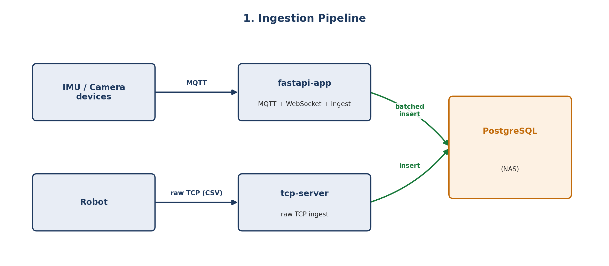
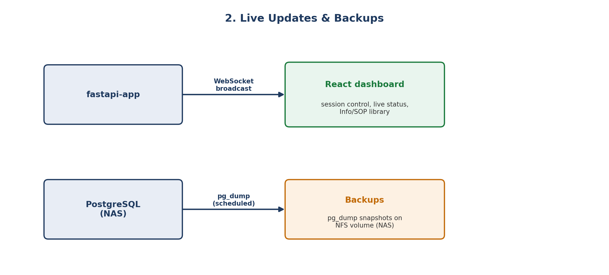
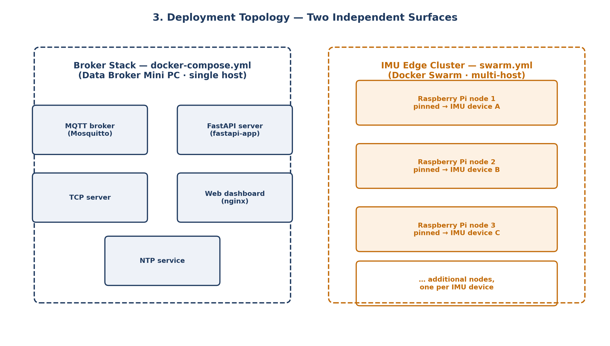
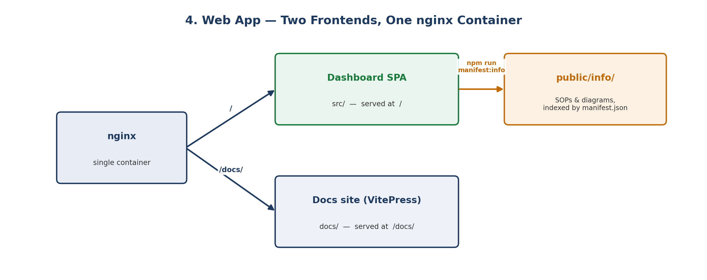

# How is this structured?

## Repository layout

```text
wku-smr-lab-middleware/
├── README.md
├── REPOS.MD                  # Links to related device-node repos and Docker Hub images
└── project/
    ├── db/                    # asyncpg pool + all database read/write logic
    │   ├── database.py
    │   └── migrations.md
    ├── fast_server/           # FastAPI app: HTTP + WebSocket + MQTT ingestion
    │   ├── main.py
    │   ├── parsing.py
    │   ├── connection_manager.py
    │   └── loggers.py
    ├── tcp_server/            # Raw TCP ingestion for robot telemetry
    │   └── tcp_server.py
    ├── mqtt_conf/             # Mosquitto broker configuration
    │   └── mosquitto.conf
    ├── SOP/                   # Standard operating procedures for the lab
    ├── tests/                 # Local test/utility scripts
    ├── docker-compose.yml     # The always-on broker stack (single host)
    ├── swarm.yml              # IMU edge node stack (multi-host Swarm)
    ├── dockerfile              # FastAPI server image
    └── web/                    # React + Vite dashboard, and this VitePress docs site
        ├── src/                # Dashboard UI (sessions, devices, Info library)
        ├── public/info/        # SOPs/diagrams served in-app via manifest.json
        ├── docs/                # This documentation site (VitePress)
        ├── nginx.conf           # Serves the SPA, proxies /api/, serves /docs/
        └── dockerfile
```

## How data flows through the system

Edge devices never talk to the database directly — everything is mediated by `fastapi-app` (MQTT-sourced IMU/camera data) or `tcp-server` (robot data). Both services share the same `db/database.py` module and the same PostgreSQL instance, keyed by the currently active session.

**Ingestion** — sensor data reaches PostgreSQL through one of two paths depending on the source device:



**Live updates & backups** — once data is in PostgreSQL, it feeds the dashboard in real time and is periodically snapshotted for durability:



## The two deployment surfaces

The system is deployed in two separate ways, described in detail under [Docker](/docker/compose):

1. **The broker stack** (`docker-compose.yml`) — runs once, on the Data Broker Mini PC. It hosts the MQTT broker, FastAPI server, TCP server, web dashboard, and NTP service.
2. **The IMU edge cluster** (`swarm.yml`) — runs across several Raspberry Pi nodes joined into a Docker Swarm, each pinned to a specific IMU device via node labels.



## The web app has two frontends

`project/web` contains two separate, independently built sites served by the same nginx container:

- **The dashboard SPA** (`src/`) — the live operational UI: session control, device status lights, message streams, backup management, and an in-app "Info" document library (`public/info/`, indexed by `manifest.json` and regenerated by `npm run manifest:info` on every build).
- **This docs site** (`docs/`, VitePress) — built separately with `npm run docs:build` and served under `/docs/` by nginx, for structural/reference documentation rather than day-to-day operation.

